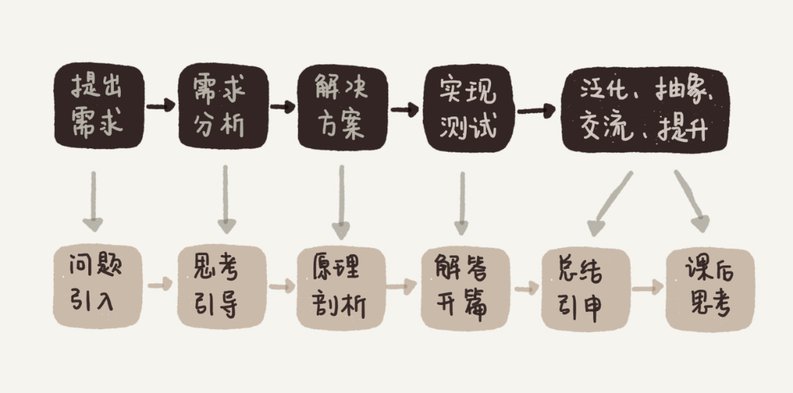

# **算法练习**
1. 学习目的和动机
   + **坏处**
   ```
      1. 应对中年危机，当前程序员青春饭问题，残酷的现状技术人究竟能够走多远，技术人的路究竟该如何走下去？我得为长远做打算，否则，就算换公司、换工作，可能本质也不会有什么改变。
      2. 业务开发工程师，你真的愿意做一辈子 CRUD Boy 吗？不能突破瓶颈，只有被淘汰
      3. 基础架构研发工程师，写出达到开源水平的框架才是你的目标！
      4. 对编程还有追求？不想被行业淘汰？那就不要只会写凑合能用的代码！
      5. 当数据规模变大时，算法的意义就凸显了。不会算法你就无法解决问题。
    ```
    + **好处**
   ```
   1.直接好处是能够有写出性能更优的代码。
   2.算法，是一种解决问题的思路和方法，有机会应用到生活和事业的其他方面。
   3.长期来看，大脑思考能力是个人最重要的核心竞争力，而算法是为数不多的能够有效训练大脑思考能力的途径之一。
   4.掌握了数据结构与算法，你看待问题的深度，解决问题的角度就会完全不一样。
   5.怼人也更加自信了。跳槽也不用畏畏缩缩的了。
   6.要想快速的做出来点事情，前提条件一定是基础能力过硬，内功到位。
   7.算法能力能够准确辨别一个程序员的技术功底是否扎实；
   8.算法能力是发掘程序员的学习能力与成长潜力的关键手段；
   9.算法能力能够协助判断程序员在面对新问题时，分析并解决问题的能力；
   10.算法能力是设计一个高性能系统、性能优化的必备基础。
   ```
    + **为什么要寻找技术本质 本质数据结构,算法,软件工程**
    ```
    上层应用框架变化频繁，细枝末节太多，浪费时间精力且无法形成沉淀，属于体力劳动。
    随着时间推移身体精力不如以前，现实生活压力变大，需要一份动态稳定工作来生活，来应对以后的物质生活和精神生活。
    本质属于基础，结构稳定不会变化
    ```
 2. 数据结构
    + **本质**
    
    如何将现实世界中各种各样的数据放入到内存中，并且如何在内存中操作这些数据，如何评价这些存储方案和操作方法。需要抽象能力。
    
    + **逻辑结构**
       + **定义：**
       
       指反映数据元素之间的逻辑关系的数据结构，其中的逻辑关系是指数据元素之间的前后间关系，而与他们在计算机中的存储位置无关。
       
       + **分类：**
          + 1.集合：数据结构中的元素之间除了“同属一个集合” 的相互关系外，别无其他关系；
          + 2.线性结构：数据结构中的元素存在一对一的相互关系；
          + 3.树形结构：数据结构中的元素存在一对多的相互关系； 
          + 4.图形结构：数据结构中的元素存在多对多的相互关系。
       
    + **存储结构**
       + **定义：**
       
       数据的逻辑结构在计算机存储空间中的存放形式
       
       + **分类：**
          + 1.顺序存储	借助元素在存储器中的相对位置来表示数据元素之间的逻辑关系；
          + 2.顺序存储 借助指示元素存储地址的指针表示数据元素之间的逻辑关系。
              常用数据结构
    
    + **常用数据结构**
    ``` 
    数组 Array
    栈 Stack
    队列 Queue
    链表 Linked List
    树 Tree
    图 Graph
    堆 Heap
    散列表 Hash
    ```
  3. 算法
  + **算法分类**
     + 检索
     + 插入
     + 删除
     + 更新
     + 排序
  + **学习方法**
    + 在刷题的过程中，把问题拆解、解题分析、得出结论、举一反三，每一个环节都要想的清清楚楚，这样才是高效的刷题方式
    + 多做题善总结
    + 原理和实用并重：从实践中总结，应用到实践中去
      + 从开篇介绍一个经典的实际问题开始（需求），
      + 到一步步思考引导（分析），
      + 再到正式引出相关的数据结构和算法（有效解决方案），
      + 再将其应用于开篇问题的解决（实现、测试），
      + 最后提出一个课后思考题（泛化、抽象、交流、提升）。
  